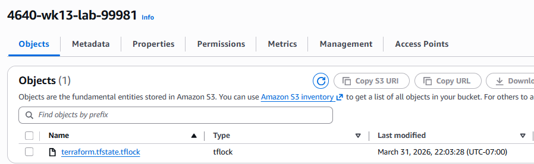

# Terraform S3 Backend Lab
Thomas de Zwart (A01199981)

## Questions
### When is the state file created?
After the initial execution of `terraform apply plan.tfplan` completes.

### When is the lock file present?
When commands that modify or rely on an up-to-date state file are executed, including:
- `terraform apply` (to no one's surprise)
- `terraform destroy` (especially when chilling before confirming the destroy)
- `terraform plan` (surprisingly!)

### Is the lock file always in the bucket after it is created?
Nope, it only exists while the command that created it is running.

## Screenshots
### State File

### Lock File + State File

### Bonus: Just Lock File!

(I saw this during the initial `terraform apply plan.tfplan`, *prior* to its completion)