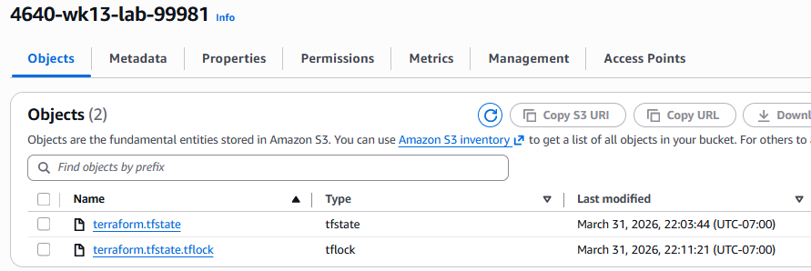
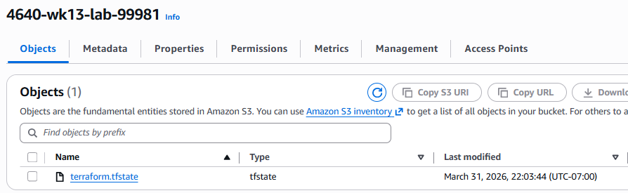

# Terraform S3 Backend Lab
- Thomas de Zwart (A01199981)

## Questions
### When is the state file created?
a

### When is the lock file present?
a

### Is the lock file always in the bucket after it is created?
a

## Screenshots
### Lock File

### State File
